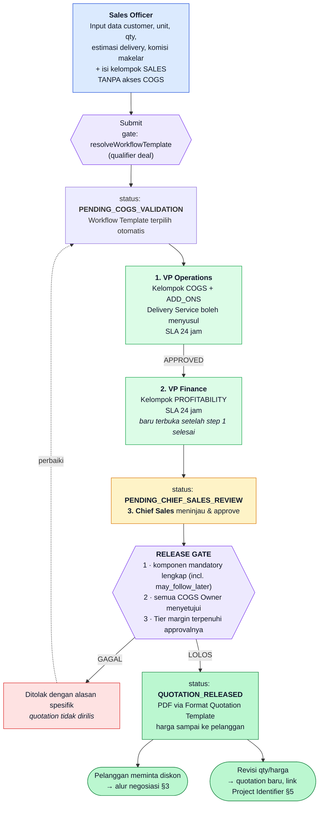
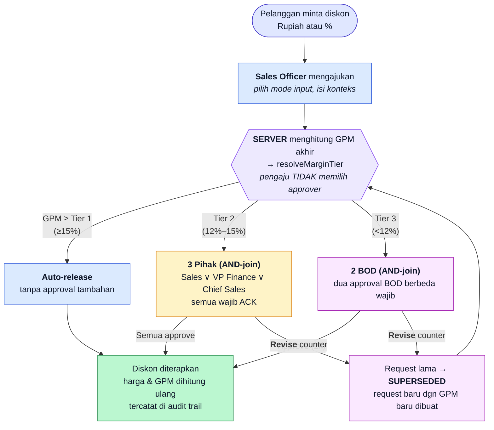
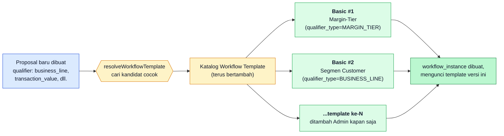
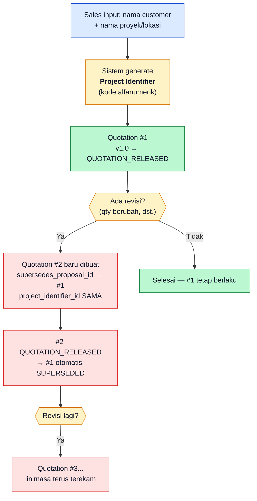

# Flow Besar & Peta Peran — Demo VKTR-PriceCore (v3.0)

Peta menyeluruh alur demo pasca-revisi: siapa berperan apa, di titik mana
mereka masuk, dan kontrol apa yang berjalan di tiap perpindahan.

> **Status dokumen.** Merupakan revisi struktural penuh mengikuti hasil
> demo review POC v2.1 (`transcribe.md`) dan `PRD-VKTR-PriceCore.md` /
> `TECHNICAL-LOGIC-VKTR-PriceCore.md` v3.0. Skenario di bawah adalah
> **blueprint untuk build berikutnya** — urutan aktor, struktur cost
> item, dan model discount authority di sini **berbeda secara
> fundamental** dari POC yang sudah didemokan (lihat §8 untuk daftar
> perubahan terhadap versi lama).

Dokumen ini adalah **gambaran besarnya**. Untuk langkah rinci beserta
angka yang harus diketik:

- [`DEMO-SCENARIO.md`](DEMO-SCENARIO.md) — skenario utama, cost structure
  riil VKTR/BTEL dengan input IDR.
- [`DEMO-SCENARIO-CNY.md`](DEMO-SCENARIO-CNY.md) — skenario kedua,
  komponen impor dengan input **CNY (RMB)** dan Rate Sensitivity Threshold.

| | |
|---|---|
| **Versi** | 3.0 (Post-Demo Revision) |
| **Dokumen sumber** | `transcribe.md` (demo review) · `BTEL-CostStructure.xlsx` · Commercial Quotation Approval System Requirement for VKTR |
| **Dokumen turunan** | [`PRD-VKTR-PriceCore.md`](PRD-VKTR-PriceCore.md) v3.0 · [`TECHNICAL-LOGIC-VKTR-PriceCore.md`](TECHNICAL-LOGIC-VKTR-PriceCore.md) v3.0 |

---

## 1. Tujuh Peran dalam Satu Halaman

| Peran | Akun demo | Masuk di tahap | Wewenang khas | Yang **tidak** bisa dilakukan |
|---|---|---|---|---|
| **Sales Officer** | `sales@vktr.demo` | Awal & negosiasi | Input data customer/unit/qty/delivery/komisi makelar; mengisi kelompok cost **`SALES`** (STNK, Insurance, Incentive, Agency Fee); mengajukan & approve diskon Tier 1/2 (sebagai salah satu dari 3 pihak) | Melihat kelompok cost `COGS`/`PROFITABILITY`/`ADD_ONS` sama sekali (bukan cuma margin — disamarkan penuh) |
| **VP Operations** | `vpops@vktr.demo` | Validasi COGS (isi lebih dulu) | Mengisi & memvalidasi kelompok **`COGS`** dan **`ADD_ONS`** (Delivery Service boleh menyusul) | Menyetujui diskon; mengisi kelompok `PROFITABILITY`/`SALES` |
| **VP Finance** | `vpfinance@vktr.demo` | Validasi COGS (setelah VP Operations selesai) | Mengisi & memvalidasi kelompok **`PROFITABILITY`**; approve diskon Tier 2 (sebagai Profitability Owner) | Mengisi kelompok `COGS`/`ADD_ONS`/`SALES` |
| **Product Owner** | `product@vktr.demo` | Sebelum/selama quotation disusun | Mengelola Product Master Data (spesifikasi, gambar, brosur, varian karoseri) yang dirujuk quotation | Mengisi cost line apa pun; ikut alur approval harga |
| **Chief Sales** | `chiefsales@vktr.demo` | Perakitan final & negosiasi | Meninjau hasil rakitan seluruh COGS Owner, approve tahap akhir (memicu Release Gate); approve diskon Tier 2 (sebagai Pricing Owner) | Approve diskon Tier 3 sendirian; melewati COGS Owner |
| **BOD** | `bod1@vktr.demo`, `bod2@vktr.demo` | Eskalasi Tier 3 | Approve / Reject / **Revise** diskon Tier 3 — **wajib dua BOD berbeda** (AND-join) | Meloloskan Tier 3 sendirian (satu approval tidak cukup) |
| **System Admin** | `admin@vktr.demo` | Sebelum/sesudah demo | Master data, Workflow Template Catalog, Margin Tier Authority, Exchange Rate config | Ikut dalam alur approval quotation |

Password seluruh akun: `PriceCore123!`

---

## 2. Flow Besar — Dari Draft sampai Quotation Diterima Pelanggan



**Kontrol yang membedakan sistem ini dari spreadsheet:**

1. **Urutan aktor sesuai SOP riil** — Sales tidak pernah melihat
   breakdown COGS; VP Operations wajib menyelesaikan approval-nya lebih
   dulu, baru tahap VP Finance terbuka (sekuensial, bukan paralel).
2. **Strict gatekeeping** — tahap berikutnya tidak terbuka sampai tahap
   sebelumnya benar-benar `APPROVED`; quotation tidak bisa "melompat"
   ke Chief Sales sebelum kedua COGS Owner menyetujui secara berurutan.
3. **`may_follow_later`** — Delivery Service boleh disusulkan tanpa
   menghambat harga dasar, namun tetap wajib terisi sebelum rilis.
4. **Release Gate berbasis Tier margin** — bukan ambang GPM tunggal,
   melainkan tiga tingkat wewenang (§3).
5. **Workflow Template Catalog** — alur approval dipilih otomatis dari
   katalog (bukan satu alur baku), mendukung puluhan varian di masa
   depan (§4).

---

## 3. Flow Negosiasi — Margin-Tier Discount Authority

Berjalan **setelah** quotation dirilis: pelanggan menerima harga, lalu
meminta diskon (dalam Rupiah **atau** persentase).



**Kunci yang sering terlewat:**

1. **Tier ditentukan oleh GPM akhir**, bukan oleh besaran diskon mentah
   — dua permintaan diskon 5% pada quotation berbeda bisa jatuh ke tier
   berbeda tergantung margin dasarnya.
2. **AND-join di dalam tier**, bukan satu approver tunggal — Tier 2
   butuh ketiganya (Sales, VP Finance, Chief Sales), Tier 3 butuh dua
   BOD berbeda.
3. **Loop dibatasi satu quotation** — begitu quotation pertama
   `QUOTATION_RELEASED`, diskon yang disetujui pada permintaan
   berikutnya menghasilkan **quotation baru** (link ke Project
   Identifier yang sama, §5), bukan negosiasi berlapis pada quotation
   yang sama.
4. **Panah dari Revise kembali ke perhitungan tier** — bila BOD
   menurunkan diskon sehingga GPM naik dari 7% ke 13%, sistem
   menghitung ulang: 13% jatuh ke Tier 2 (3 pihak), bukan otomatis
   disetujui.

### Peringatan margin muncul sebelum keputusan

Setiap permintaan diskon menampilkan dampaknya **saat itu juga** — harga
sesudah diskon, GPM baru, dan tier yang berlaku. Angka ini di-*snapshot*
ketika permintaan dibuat, sehingga seluruh pihak (Sales, VP Finance,
Chief Sales, BOD) melihat dasar yang sama persis.

> Inilah jawaban langsung atas *"limited visibility of actual
> profitability during commercial negotiations"* pada dokumen kebutuhan.

---

## 4. Workflow Template Catalog — Bukan Satu Alur Baku

Perbedaan paling mendasar dari POC lama: alur approval **dipilih dari
katalog**, bukan hardcode satu alur untuk semua quotation.



**Basic Workflow minimal dua varian tersedia sejak go-live** (PRD
FR-2.0.2):

| # | Nama | Qualifier | Efeknya |
|---|---|---|---|
| 1 | Margin-Tier Escalation | `MARGIN_TIER` | Mengatur eskalasi **diskon** (Auto/3-Pihak/2-BOD) — dipakai bersama Negotiation Engine (§3) |
| 2 | Segmen Customer | `BUSINESS_LINE` (B2G/B2B/B2C) | Mengatur tahap **approval COGS tambahan** untuk segmen tertentu, mis. B2G mensyaratkan dokumentasi lebih ketat |

Keduanya bisa aktif **bersamaan** untuk satu proposal — satu mengatur
approval COGS, satu lagi mengatur approval diskon. Admin dapat menambah
template baru kapan saja tanpa mengubah kode; VKTR memperkirakan
puluhan varian akan muncul organik dalam 6 bulan pertama.

---

## 5. Project Identifier — Melacak Revisi Quotation



- Revisi **tidak pernah** mengedit quotation yang sudah rilis — selalu
  quotation baru, agar histori harga yang pernah dikirim ke pelanggan
  tetap utuh untuk audit.
- Dashboard (Module 3) mengelompokkan seluruh quotation pada satu
  Project Identifier sebagai satu linimasa.

---

## 6. Cost Structure Riil VKTR/BTEL — Empat Kelompok

Menggantikan daftar item ilustratif (Battery/Chassis/Powertrain sebagai
item terpisah) pada POC lama. Sumber: `BTEL-CostStructure.xlsx`.

> **Kenapa hanya "FOB Price", bukan rincian Battery/Chassis/Powertrain?**
> VKTR membeli unit dari BTEL sebagai **satu barang jadi** — sudah
> dirakit sebelum masuk ke PriceCore ("sampai keluar dari mesin
> produksi, semua sama", demo review). Sistem ini tidak merakit mobil
> dari sub-komponen; **FOB Price** adalah satu angka gabungan yang
> sudah mencakup nilai battery, chassis, dan powertrain di dalamnya.

| Kelompok | Contoh Item | Pengisi *(asumsi, perlu konfirmasi VKTR)* |
|---|---|---|
| **COGS** | FOB Price (CNY/IDR) — harga beli unit jadi, Freight & Insurance, Custom Duties, Port Handling & PDI, Carrosserie Allocation, Assembly Cost, Local Parts, Accessories, Telematics, Warehousing, Warranty Cost, Initial Energy Injection, Administrative Cost | **VP Operations** |
| **Profitability** | VKTS Profit Before Tax, VKTS Margin, VKTR Profit Before Financing Cost, Financing Cost, VKTR Margin After Financing Cost | **VP Finance** |
| **Sales** | STNK, Insurance, Incentive Internal, Incentive External, Sales Processing Cost, Agency Fee | **Sales Officer** |
| **Add-Ons** | Processing Service, Delivery Service *(may_follow_later)*, KEUR, Additional | **VP Operations** |

> **Satu master data untuk semua lini bisnis.** Struktur ini **sama**
> untuk B2G/B2B/B2C — yang membedakan segmen hanyalah Workflow Template
> (§4) dan biaya tambahan pada kelompok Sales, bukan struktur CBS-nya.

---

## 7. Peta Modul → Peran → Kontrol

| Modul | Peran utama | Kontrol yang dibuktikan |
|---|---|---|
| Master Data & CBS (tunggal) | System Admin | Satu struktur cost untuk semua lini bisnis; setiap item punya owner jelas |
| Product Master Data | Product Owner | Spesifikasi/gambar/brosur terpisah dari cost, dirujuk quotation |
| Pricing Engine | VP Operations, VP Finance | GPM/EBITDA/BEP terhitung otomatis; formula tunggal untuk semua lini bisnis |
| Multi-Currency + Rate Sensitivity | Semua pengisi | Input CNY/IDR (basis FOB Price, RMB); notifikasi saat kurs bergerak melebihi ambang; hitung ulang eksplisit |
| Mineral Index (referensi) | System Admin | HMA/HPM tampil sebagai konteks, dampak riil lewat kurs |
| Workflow Template Catalog | System Admin | Alur approval dipilih otomatis dari katalog, bukan hardcode |
| COGS Validation | VP Operations → VP Finance | Sekuensial: VP Finance baru terbuka setelah VP Operations APPROVED, quotation menunggu keduanya selesai berurutan |
| Release Gate | Chief Sales | Termasuk pengecualian `may_follow_later` tanpa mengorbankan kelengkapan rilis |
| Margin-Tier Negotiation | Sales → 3 Pihak / 2 BOD | Tier dihitung server dari GPM akhir; AND-join di dalam tier |
| Project Identifier | Sales, Chief Sales | Revisi quotation terlacak sebagai satu linimasa, bukan quotation lepas |
| Duplicate/Fraud Guard | Sales Officer | Maksimal 1 quotation/hari per customer+tipe unit |
| RBAC | Sales Officer vs VP Finance/Operations | Sales tidak melihat kelompok COGS/Profitability/Add-Ons sama sekali |
| Observability | Semua | Kanban per Project Identifier, SLA timer, audit trail *append-only* |
| DSS | BOD, VP Finance | What-If slider (FX aktif, HMA referensi), guardrail alert |

---

## 8. Perubahan Terhadap POC Lama (v2.1 → v3.0)

| Aspek | POC lama (v2.1) | Revisi v3.0 |
|---|---|---|
| Master data | CBS berbeda per lini bisnis (asumsi) | **Satu CBS tunggal**, struktur riil BTEL (4 kelompok) |
| Urutan aktor | Chief Sales menyusun di awal | **Sales → VP Operations → VP Finance → Chief Sales** |
| Aktor | 6 peran | **7 peran** (+ Product Owner) |
| Workflow | Satu alur baku (VP Finance ∥ VP Operations paralel → Chief Sales) | **Katalog Workflow Template**, dipilih otomatis dari qualifier — default sekuensial VP Operations → VP Finance → Chief Sales |
| Discount authority | Tangga % diskon (3%/8%/BOD) | **Tangga GPM akhir** (Auto/3-Pihak/2-BOD) |
| Input diskon | Persentase saja | **Rupiah atau persentase** |
| Versioning quotation | `pricing_proposal_version` per proposal | **Project Identifier** lintas-proposal, quotation baru per revisi |
| Exchange rate | Input manual, basis USD | **Otomatis mingguan dari API bank, basis CNY/RMB** (dikoreksi dari USD — FOB Price dikutip vendor dalam CNY) + override manual |
| Rate sensitivity | Tidak ada | **Ambang % + notifikasi + tombol Hitung Ulang eksplisit** |
| Mineral Index | Faktor pengali otomatis independen | **Referensi/transparansi saja** — dampak riil lewat kurs |
| Fraud guard | Tidak ada | **Maks. 1 quotation/hari** per customer+tipe unit |
| Format Quotation | Tidak dispesifikasikan | **Template PDF baku** (FR-1.5.3) |

---

## 9. Menyiapkan & Mengulang Demo

> **Catatan.** Skrip di bawah mengasumsikan build v3.0 sudah tersedia.
> Sebelum build baru selesai, `npm run seed:demo` / `reset:demo` masih
> mengacu ke skema POC lama — jangan dijalankan terhadap ekspektasi
> skenario di dokumen ini sampai migrasi data selesai.

```bash
npm run reset:demo      # kembalikan ke kondisi sebelum demo
```

Menghapus quotation buatan demo beserta workflow, negosiasi, dan audit
log-nya; mengembalikan quotation historis ke posisi semula. Master data
dan akun demo tidak disentuh — tidak perlu seed ulang maupun membuka
Supabase Dashboard. Aman dijalankan berkali-kali.
