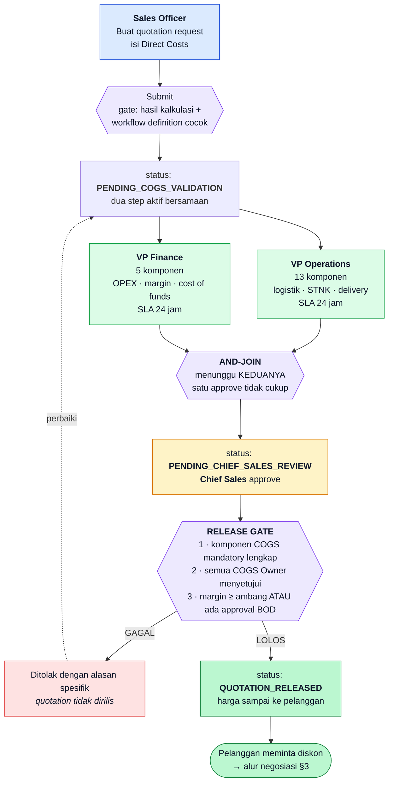
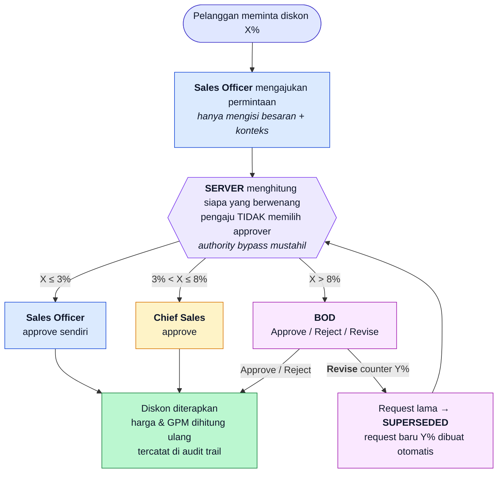
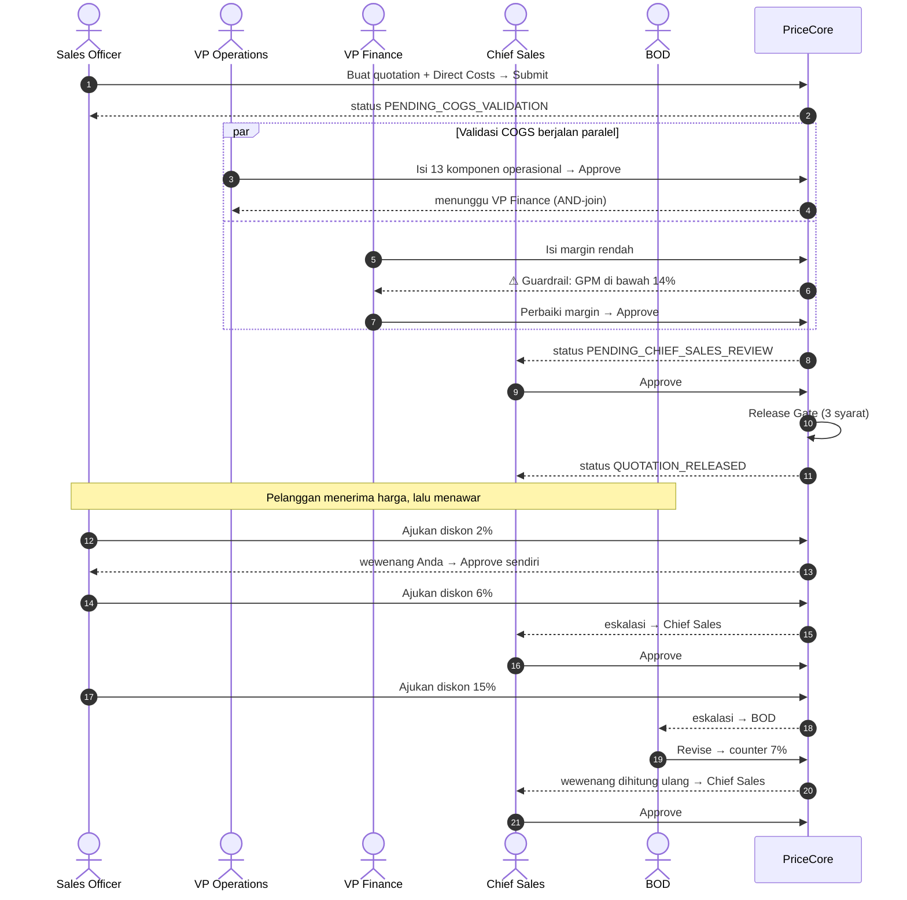
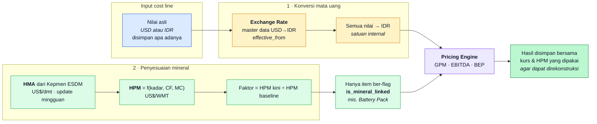

# Flow Besar & Peta Peran — Demo VKTR-PriceCore

Peta menyeluruh alur demo POC: siapa berperan apa, di titik mana mereka
masuk, dan kontrol apa yang berjalan di tiap perpindahan.

Dokumen ini adalah **gambaran besarnya**. Untuk langkah rinci beserta
angka yang harus diketik, lihat [`DEMO-SCENARIO.md`](DEMO-SCENARIO.md).

| | |
|---|---|
| **Versi** | 2.1 (Multi-Currency & Mineral Index) |
| **Dokumen sumber** | Commercial Quotation Approval System Requirement for VKTR · Simulasi_HPM_Nikel_Kepmen_2026.xlsx |
| **Dokumen turunan** | [`PRD-VKTR-PriceCore.md`](PRD-VKTR-PriceCore.md) · [`TECHNICAL-LOGIC-VKTR-PriceCore.md`](TECHNICAL-LOGIC-VKTR-PriceCore.md) |

---

## 1. Enam Peran dalam Satu Halaman

| Peran | Akun demo | Masuk di tahap | Wewenang khas | Yang **tidak** bisa dilakukan |
|---|---|---|---|---|
| **Sales Officer** | `sales@vktr.demo` | Awal & negosiasi | Membuat quotation, mengajukan diskon, approve diskon ≤ 3% | Melihat *raw margin* (tampil `••••`); approve diskon > 3% |
| **VP Operations** | `vpops@vktr.demo` | Validasi COGS (paralel) | Mengisi & memvalidasi **13 komponen** operasional | Menyetujui diskon; mengisi komponen milik VP Finance saat bukan gilirannya |
| **VP Finance** | `vpfinance@vktr.demo` | Validasi COGS (paralel) | Mengisi & memvalidasi **5 komponen** finansial/margin | Menyetujui diskon |
| **Chief Sales** | `chiefsales@vktr.demo` | Perakitan final & negosiasi | Approve tahap akhir (memicu Release Gate), approve diskon ≤ 8% | Approve diskon > 8%; melewati COGS Owner |
| **BOD** | `bod@vktr.demo` | Eskalasi diskon besar | Approve / Reject / **Revise** diskon tanpa batas; satu-satunya yang boleh menembus ambang margin | — |
| **System Admin** | `admin@vktr.demo` | Sebelum/sesudah demo | Master data, CBS template, workflow, ambang diskon | Ikut dalam alur approval quotation |

Password seluruh akun: `PriceCore123!`

---

## 2. Flow Besar — Dari Draft sampai Quotation Diterima Pelanggan



**Tiga kontrol yang membedakan sistem ini dari spreadsheet:**

1. **AND-join** — quotation tidak bergerak hanya karena satu VP setuju.
2. **Release Gate** — komponen COGS yang belum lengkap menghentikan rilis,
   bukan sekadar memberi peringatan.
3. **Field masking** — Sales Officer melihat harga final, bukan raw margin.

---

## 3. Flow Negosiasi — Delegated Discount Authority

Berjalan **setelah** quotation dirilis: pelanggan menerima harga, lalu
meminta diskon.



**Kunci yang sering terlewat:** panah dari *Revise* kembali ke kotak
perhitungan wewenang. Ketika BOD menurunkan diskon dari 15% menjadi 7%,
sistem **menghitung ulang** siapa yang berwenang — 7% jatuh ke Chief
Sales, bukan otomatis disetujui hanya karena BOD yang mengusulkannya.

### Peringatan margin muncul sebelum keputusan

Setiap permintaan diskon menampilkan dampaknya **saat itu juga** — harga
sesudah diskon, GPM baru, dan penanda merah bila menembus ambang. Angka
ini di-*snapshot* ketika permintaan dibuat, sehingga approver melihat
dasar yang sama persis dengan pengaju.

> Inilah jawaban langsung atas *"limited visibility of actual
> profitability during commercial negotiations"* pada dokumen kebutuhan.

**Catatan penting untuk demo.** Pada quotation contoh, GPM 15,25% dengan
ambang 14% — jaraknya hanya 1,25 poin. Karena diskon memotong harga jual
sementara biaya tetap, **diskon 2% pun sudah menembus ambang**. Peringatan
yang muncul sejak diskon terkecil bukan kelemahan; justru itu yang ingin
diperlihatkan.

---

## 4. Urutan Login Sepanjang Sesi Demo

Satu sesi lengkap butuh **8 kali perpindahan peran**. Urutan ini tidak
boleh diacak — tiap tahap membuka tahap berikutnya.



| # | Login sebagai | Yang dikerjakan | Status setelahnya |
|---|---|---|---|
| 1 | Sales Officer | Buat quotation, isi Direct Costs, submit | `PENDING_COGS_VALIDATION` |
| 2 | VP Operations | Isi 13 komponen operasional → Approve | tetap (menunggu VP Finance) |
| 3 | VP Finance | Isi margin **rendah** → picu guardrail | tetap |
| 4 | VP Finance | Perbaiki margin → Approve | `PENDING_CHIEF_SALES_REVIEW` |
| 5 | Chief Sales | Approve → Release Gate berjalan | `QUOTATION_RELEASED` |
| 6 | Sales Officer | Ajukan diskon 2% → approve sendiri | dirilis, diskon 2% |
| 7 | Sales Officer → Chief Sales | Ajukan 6% → eskalasi → Chief Sales approve | dirilis, diskon 6% |
| 8 | Sales Officer → BOD → Chief Sales | Ajukan 15% → BOD **Revise** jadi 7% → Chief Sales approve | dirilis, diskon 7% |

> **Tips demo.** Buka beberapa jendela Incognito terpisah, satu per peran,
> supaya tidak perlu logout-login berulang.

---

## 5. Dua Faktor Global yang Membentuk Harga (v2.1)

Sebelum quotation dihitung, dua penyesuaian berjalan otomatis. Keduanya
**tidak memerlukan approval terpisah** — sudah disetujui secara sistem —
tetapi selalu tercatat di audit trail.



**Urutan tidak boleh dibalik.** Konversi mata uang lebih dulu, baru faktor
penyesuaian. Mengalikan faktor pada angka yang belum satu satuan
menghasilkan nilai salah yang tidak terlihat salah.

### Formula HPM (Kepmen ESDM No. 144.K/2026)

```
CF(Ni)       = 0,30 + ((kadar_Ni − 0,016) × 10)
Nilai Ni     = kadar_Ni × CF(Ni) × HMA_Ni
Bonus Co     = kadar_Co × CF(Co) × HMA_Co
Total kering = Nilai Ni + Bonus Co             [US$/dmt]
HPM basah    = Total kering × (1 − Moisture)   [US$/WMT]
```

Dengan HMA Ni US$ 16.646/dmt, HMA Co US$ 28.500/dmt, MC 35%:

| Kadar Ni | CF | HPM (US$/WMT) |
|---|---|---|
| 1,3% | 27,0% | 41,68 |
| 1,5% | 29,0% | 50,77 |
| **1,6% (anchor)** | **30,0%** | **55,64** |
| 1,7% | 31,0% | 60,73 |
| 1,8% | 32,0% | 66,03 |

Contoh: baseline 55,64 → HPM berjalan 60,73 menghasilkan faktor **1,0915**,
sehingga komponen Battery Pack naik **9,15%** secara otomatis.

> Bila HMA terakhir sudah lewat 14 hari, quotation ditandai *stale index* —
> **tidak diblokir**, karena menghentikan proses komersial akibat
> keterlambatan publikasi regulasi lebih merugikan daripada risikonya.

---

## 6. Peta Modul → Peran → Kontrol

| Modul | Peran utama | Kontrol yang dibuktikan |
|---|---|---|
| Master Data & CBS | System Admin | Setiap komponen biaya punya COGS Owner yang jelas |
| Pricing Engine | VP Finance, VP Operations | GPM/EBITDA/BEP terhitung otomatis tiap perubahan |
| Multi-Currency | Semua pengisi | Input USD/IDR; konversi oleh sistem, kurs tersimpan di hasil |
| Mineral Index | System Admin (input HMA) | HPM dihitung dari Kepmen; faktor global ke komponen mineral |
| COGS Validation | VP Finance ∥ VP Operations | AND-join: dua validator paralel, quotation menunggu keduanya |
| Release Gate | Chief Sales | Tiga syarat wajib sebelum harga sampai ke pelanggan |
| Negotiation | Sales Officer → Chief Sales → BOD | Approver ditentukan server; Revise menghitung ulang wewenang |
| RBAC | Sales Officer vs VP Finance | `••••` vs angka margin sesungguhnya |
| Observability | Semua | Kanban, SLA timer, audit trail *append-only* |
| DSS | BOD, VP Finance | What-If slider, guardrail alert, Win/Loss price band |

---

## 7. Konfigurasi yang Berlaku Saat Demo

Nilai-nilai berikut sudah terpasang di database demo.

**Ambang GPM minimum per lini bisnis**

| Lini bisnis | Ambang |
|---|---|
| B2G Tender Bus | 14,0% |
| B2B Commercial Fleet | 16,0% |
| Charging Infra Buildout | 18,0% |

**Tangga wewenang diskon**

| Urutan | Peran | Batas |
|---|---|---|
| 1 | Sales Officer | ≤ 3% |
| 2 | Chief Sales | ≤ 8% |
| 3 | BOD | tanpa batas |

**Kepemilikan komponen biaya**

| COGS Owner | Jumlah komponen aktif |
|---|---|
| VP Operations | 13 |
| VP Finance | 5 |

**Workflow B2G Quotation Approval**

| Urutan | Peran | Grup paralel | SLA |
|---|---|---|---|
| 1 | VP Finance | `COGS` | 24 jam |
| 1 | VP Operations | `COGS` | 24 jam |
| 2 | Chief Sales | — | 24 jam |

> Seluruh angka ini adalah **konfigurasi, bukan hardcode** — dapat diubah
> lewat master data tanpa rilis ulang aplikasi. Ambang diskon 3%/8% masih
> ilustratif dan perlu dikonfirmasi ke Chief Sales & BOD.

---

## 8. Yang Belum Ada di POC

Perlu disampaikan terbuka bila ditanya saat demo.

| Kebutuhan | Status |
|---|---|
| Customer KYC & Opportunity Assessment | Tercatat di PRD Module 7, **belum dibangun** |
| Notifikasi SLA ke Email/Teams/WhatsApp | Hanya badge "SLA Breached" di UI |
| Ekspor ke ERP/CRM | Quotation berhenti di PriceCore |
| Write lock per-field | Baru per-step: COGS Owner yang aktif bisa mengubah semua baris |
| Formula builder no-code | Rumus fixed per lini bisnis; komponen & nilainya tetap dinamis |
| Tarik kurs & HMA otomatis dari API | Diinput manual sebagai master data; sumber otomatis masih keputusan terbuka |

---

## 9. Menyiapkan & Mengulang Demo

```bash
npm run reset:demo      # kembalikan ke kondisi sebelum demo
```

Menghapus quotation buatan demo beserta workflow, negosiasi, dan audit
log-nya; mengembalikan 15 quotation historis ke posisi semula. Master data
dan keenam akun demo tidak disentuh — tidak perlu seed ulang maupun
membuka Supabase Dashboard. Aman dijalankan berkali-kali.
