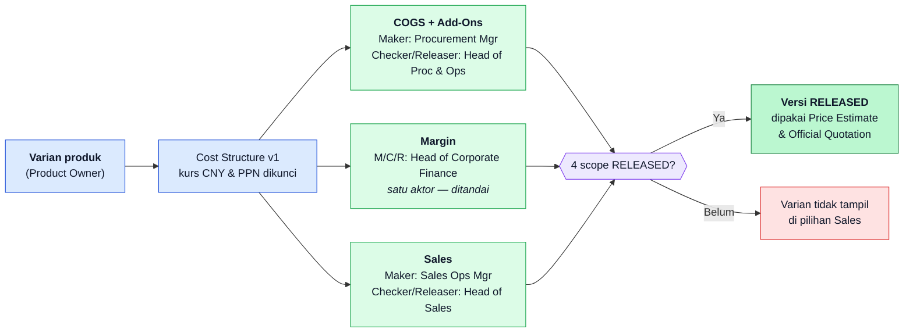
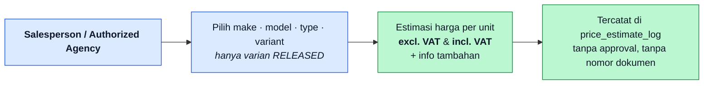
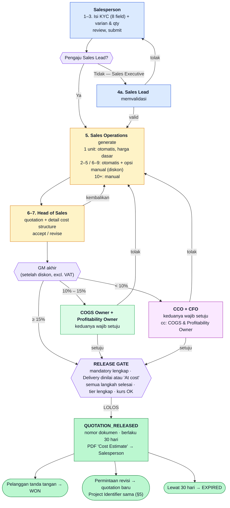
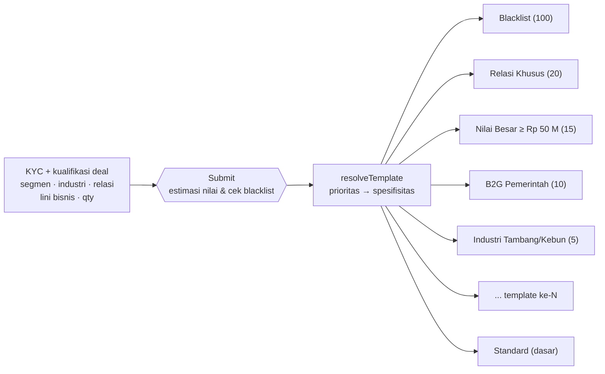
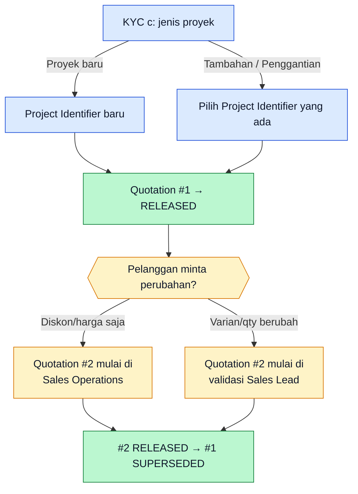

# Flow Besar & Peta Peran — Demo VKTR-PriceCore (v4.0)

Peta menyeluruh alur demo setelah konfirmasi VKTR: siapa berperan apa,
di titik mana mereka masuk, dan kontrol apa yang berjalan di tiap
perpindahan.

> **Status dokumen.** Revisi mengikuti `BTEL - Cost and Roles and
> Flow.xlsx` (sheet *Cost Structure*, *Actors*, *Basic Workflow*) dan
> contoh dokumen `Cost Estimate - PT Siborong Nusa Gemilang
> 20260906.pdf`, serta `PRD-VKTR-PriceCore.md` /
> `TECHNICAL-LOGIC-VKTR-PriceCore.md` v4.0 — **sudah dibangun** di
> aplikasi. Perbedaan terhadap POC v3.0 ada di §9.
>
> Skrip demo per workflow: [`DEMO-FLOW-PRICE-ESTIMATE.md`](DEMO-FLOW-PRICE-ESTIMATE.md)
> dan [`DEMO-FLOW-OFFICIAL-QUOTATION.md`](DEMO-FLOW-OFFICIAL-QUOTATION.md).

Dokumen ini adalah **gambaran besarnya**. Untuk langkah rinci beserta
angka yang harus diketik:

- [`DEMO-SCENARIO.md`](DEMO-SCENARIO.md) — skenario utama: Settings,
  cost structure Maker/Checker/Releaser, Price Estimate, Official
  Quotation 1 / 4 / 40 unit, tier 15%/10%, preview & cetak dokumen.
- [`DEMO-SCENARIO-CNY.md`](DEMO-SCENARIO-CNY.md) — skenario kedua: FOB
  dalam **CNY (RMB)**, kurs terkunci per versi cost structure, dan Rate
  Sensitivity Threshold.

| | |
|---|---|
| **Versi** | 4.0 |
| **Dokumen sumber** | `BTEL - Cost and Roles and Flow.xlsx` · `Cost Estimate - PT Siborong Nusa Gemilang 20260906.pdf` · `transcribe.md` |
| **Dokumen turunan** | [`PRD-VKTR-PriceCore.md`](PRD-VKTR-PriceCore.md) v4.0 · [`TECHNICAL-LOGIC-VKTR-PriceCore.md`](TECHNICAL-LOGIC-VKTR-PriceCore.md) v4.0 |

---

## 1. Peran dalam Satu Halaman

Seluruh peran di bawah adalah **data di Settings → Roles &
Authorities**, bukan daftar tetap di kode — Admin dapat menambah,
mengganti nama, dan mengubah wewenangnya (PRD FR-5.6).

| Peran | Akun demo | Peran fungsional | Masuk di tahap | Wewenang khas | Yang **tidak** bisa dilakukan |
|---|---|---|---|---|---|
| **Authorized Agency** | `agency@vktr.demo` | Eksternal | Price Estimate | Melihat estimasi harga per unit excl./incl. VAT | Mengajukan Official Quotation; melihat cost structure |
| **Sales Executive** | `sales.exec@vktr.demo` | Salesperson | Awal | Price Estimate; isi KYC & submit Official Quotation; cetak quotation rilis | Melihat cost structure; menetapkan diskon |
| **Sales Lead** | `sales.lead@vktr.demo` | Salesperson + validator | Awal & validasi | Sama seperti Sales Executive + **memvalidasi** permintaan Sales Executive; permintaannya sendiri langsung ke Sales Operations | Melihat cost structure |
| **Sales Operations Manager** | `salesops@vktr.demo` | Sales Pricing Owner | *Generate* | *Generate* quotation per quantity band, atur diskon, proses manual 10+ unit; Maker/Checker/Releaser scope **Sales** | Merilis quotation; mengubah scope COGS/Margin |
| **Head of Sales** | `headsales@vktr.demo` | Sales Pricing Owner + releaser | Review & rilis | Melihat quotation **+ detail cost structure**, *accept/revise*, merilis GM ≥ 15%; M/C/R scope **Sales** | Merilis GM < 15% tanpa approver tier |
| **Procurement Manager** | `procurement@vktr.demo` | COGS Owner | Cost structure & Tier 2 | M/C/R scope **COGS** & **Add-Ons**; approve Tier 2 | Mengubah scope Margin/Sales |
| **Head of Procurement and Operations Control** | `headproc@vktr.demo` | COGS Owner | Cost structure & Tier 2 | Sama seperti Procurement Manager; menerima tembusan Tier 3 | Idem |
| **Head of Corporate Finance** | `headfinance@vktr.demo` | Profitability Owner | Cost structure & Tier 2 | M/C/R scope **Margin** (kelompok Profitability); approve Tier 2; tembusan Tier 3 | Mengubah scope COGS/Sales |
| **Chief Commercial Officer** | `cco@vktr.demo` | Pricing Committee | Tier 3 / Deviation | Approve Tier 3 (bersama CFO); M/C/R semua scope **hanya** pada skenario Deviation (GM < 10%) | Meloloskan Tier 3 sendirian; bertindak pada skenario Regular |
| **Chief Finance Officer** | `cfo@vktr.demo` | Pricing Committee | Tier 3 / Deviation | Idem CCO | Idem |
| **Product Owner** | `product@vktr.demo` | Product Owner | Sebelum quotation | Varian produk, spesifikasi, gambar, inclusions/exclusions *default* | Mengisi biaya; approval harga |
| **System Admin** | `admin@vktr.demo` | Admin | Sebelum/sesudah demo | Settings: role & wewenang, workflow, quantity band, tier, PPN, template dokumen | Ikut dalam approval |

Password seluruh akun: `PriceCore123!`

### Menu yang terlihat per peran (PRD FR-5.7)

Menu di luar daftar ini **tidak tampil** di sidebar dan halamannya
menjawab **404** bila dibuka lewat URL. Diatur di Settings → Akses Menu.

| Menu | Authorized Agency | Sales Executive | Sales Lead | Sales Ops Mgr | Head of Sales | Procurement Mgr | Head of Proc & Ops Control | Head of Corp Finance | CCO | CFO | Product Owner | System Admin |
|---|---|---|---|---|---|---|---|---|---|---|---|---|
| Overview (antrean "menunggu tindakan Anda") | – | ✓ | ✓ | ✓ | ✓ | ✓ | ✓ | ✓ | ✓ | ✓ | – | ✓ |
| Price Estimate | ✓ | ✓ | ✓ | ✓ | ✓ | – | – | – | – | – | – | ✓ |
| Official Quotation | – | ✓ ¹ | ✓ ² | ✓ | ✓ | ✓ | ✓ | ✓ | ✓ | ✓ | – | ✓ |
| Lifecycle & Approvals | – | – | – | ✓ | ✓ | ✓ | ✓ | ✓ | ✓ | ✓ | – | ✓ |
| Cost Structure (M/C/R) | – | – | – | ✓ | ✓ | ✓ | ✓ | ✓ | ✓ | ✓ | – | ✓ |
| Decision Support (DSS) | – | – | – | ✓ | ✓ | ✓ | ✓ | ✓ | ✓ | ✓ | – | ✓ |
| Master Data & Kurs | – | – | – | – | – | ✓ | ✓ | ✓ | ✓ | ✓ | – | ✓ |
| Product Master Data | – | – | – | – | – | – | – | – | – | – | ✓ | ✓ |
| Audit Trail | – | – | – | – | ✓ | – | – | – | ✓ | ✓ | – | ✓ |
| Settings | – | – | – | – | – | – | – | – | – | – | – | ✓ (terkunci) |
| **Halaman awal setelah login** | Price Estimate | Overview | Overview | Overview | Overview | Overview | Overview | Overview | Overview | Overview | Product Master Data | Overview |

¹ Hanya quotation yang ia ajukan / ia menjadi Sales/Account Person.
² Quotation miliknya + permintaan Sales Executive yang ia validasi (POC belum mengenal struktur tim, sehingga semua permintaan Sales Executive).

---

## 2. Lapisan 0 — Cost Structure per Varian (Maker → Checker → Releaser)

Biaya **tidak lagi diisi per quotation**. Setiap varian produk punya
*price book* berversi; setiap scope dirilis oleh pemiliknya lewat tiga
tahap. Hanya versi yang keempat scope-nya `RELEASED` yang bisa dipakai
Price Estimate dan Official Quotation.


```mermaid
flowchart LR
    V["<b>Varian produk</b><br/>(Product Owner)"] --> CS["Cost Structure v1<br/>kurs CNY & PPN dikunci"]

    CS --> C1["<b>COGS + Add-Ons</b><br/>Maker: Procurement Mgr<br/>Checker/Releaser: Head of Proc & Ops"]
    CS --> C2["<b>Margin</b><br/>M/C/R: Head of Corporate Finance<br/><i>satu aktor — ditandai</i>"]
    CS --> C3["<b>Sales</b><br/>Maker: Sales Ops Mgr<br/>Checker/Releaser: Head of Sales"]

    C1 --> R{{"4 scope RELEASED?"}}
    C2 --> R
    C3 --> R
    R -->|Ya| OK["<b>Versi RELEASED</b><br/>dipakai Price Estimate<br/>& Official Quotation"]
    R -->|Belum| W["Varian tidak tampil<br/>di pilihan Sales"]

    classDef prod fill:#dbeafe,stroke:#1d4ed8,color:#0f172a
    classDef scope fill:#dcfce7,stroke:#16a34a,color:#0f172a
    classDef gate fill:#ede9fe,stroke:#7c3aed,color:#0f172a
    classDef ok fill:#bbf7d0,stroke:#15803d,color:#0f172a
    classDef bad fill:#fee2e2,stroke:#dc2626,color:#0f172a
    class V,CS prod
    class C1,C2,C3 scope
    class R gate
    class OK ok
    class W bad
```

- Scope berjalan **independen** — COGS dan Margin bisa diproses
  bersamaan (menggantikan urutan wajib VP Operations → VP Finance v3.0).
- Aturan default: **Maker ≠ Checker** bila scope punya ≥ 2 aktor.
  Scope Margin hanya punya satu aktor, sehingga satu orang menjalankan
  ketiga tahap dan audit trail menandainya — perlu keputusan VKTR.
- **Skenario Deviation** (GM < 10%): CCO dan CFO ikut berwenang
  Maker/Checker/Releaser di semua scope.

---

## 3. Lapisan A — Price Estimate


```mermaid
flowchart LR
    A["<b>Salesperson / Authorized Agency</b>"] --> B["Pilih make · model · type · variant<br/><i>hanya varian RELEASED</i>"]
    B --> C["Estimasi harga per unit<br/><b>excl. VAT</b> & <b>incl. VAT</b><br/>+ info tambahan"]
    C --> D["Tercatat di price_estimate_log<br/>tanpa approval, tanpa nomor dokumen"]

    classDef a fill:#dbeafe,stroke:#1d4ed8,color:#0f172a
    classDef ok fill:#bbf7d0,stroke:#15803d,color:#0f172a
    class A,B a
    class C,D ok
```

Estimasi = harga dasar 1 unit tanpa diskon. **Tidak ada satu pun
elemen cost structure** di layar maupun di respons API.

---

## 4. Lapisan B & C — Official Quotation (sheet *Basic Workflow*)


```mermaid
flowchart TD
    A["<b>Salesperson</b><br/>1–3. Isi KYC (8 field) + varian & qty<br/>review, submit"] --> V{{"Pengaju Sales Lead?"}}
    V -->|Tidak — Sales Executive| SL["<b>4a. Sales Lead</b> memvalidasi"]
    V -->|Ya| SO
    SL -->|tolak| A
    SL -->|valid| SO["<b>5. Sales Operations</b> generate<br/>1 unit: otomatis, harga dasar<br/>2–5 / 6–9: otomatis + opsi manual (diskon)<br/>10+: manual"]

    SO --> HS["<b>6–7. Head of Sales</b><br/>quotation + detail cost structure<br/>accept / revise"]
    HS -->|kembalikan| SO

    HS --> T{{"GM akhir<br/>(setelah diskon, excl. VAT)"}}
    T -->|"≥ 15%"| G
    T -->|"10% – 15%"| T2["<b>COGS Owner + Profitability Owner</b><br/>keduanya wajib setuju"]
    T -->|"< 10%"| T3["<b>CCO + CFO</b><br/>keduanya wajib setuju<br/>cc: COGS & Profitability Owner"]

    T2 -->|setuju| G
    T3 -->|setuju| G
    T2 -->|tolak| SO
    T3 -->|tolak| SO

    G{{"<b>RELEASE GATE</b><br/>mandatory lengkap · Delivery dinilai atau 'At cost'<br/>semua langkah selesai · tier lengkap · kurs OK"}}
    G -->|LOLOS| R["<b>QUOTATION_RELEASED</b><br/>nomor dokumen · berlaku 30 hari<br/>PDF 'Cost Estimate' → Salesperson"]

    R --> W(["Pelanggan tanda tangan → WON"])
    R --> RV(["Permintaan revisi → quotation baru<br/>Project Identifier sama (§5)"])
    R --> EX(["Lewat 30 hari → EXPIRED"])

    classDef sales fill:#dbeafe,stroke:#1d4ed8,color:#0f172a
    classDef ops fill:#fef3c7,stroke:#d97706,color:#0f172a
    classDef owner fill:#dcfce7,stroke:#16a34a,color:#0f172a
    classDef pc fill:#fae8ff,stroke:#a21caf,color:#0f172a
    classDef gate fill:#ede9fe,stroke:#7c3aed,color:#0f172a
    classDef ok fill:#bbf7d0,stroke:#15803d,color:#0f172a
    class A,SL sales
    class SO,HS ops
    class T2 owner
    class T3 pc
    class V,T,G gate
    class R,W,RV,EX ok
```

**Kontrol yang membedakan sistem ini dari spreadsheet:**

1. **Salesperson tidak pernah melihat cost structure** — ia mengisi
   KYC, lalu menerima quotation rilis.
2. **Quotation hanya dari cost structure yang sudah dirilis** —
   validasi biaya terjadi di hulu, sehingga 1–9 unit bisa otomatis.
3. **Tier dari GM setelah diskon**, dihitung server — Sales Operations
   dan Head of Sales melihat tier yang akan berlaku sebelum meneruskan.
4. **AND-join** di Tier 2 dan Tier 3; tembusan Tier 3 hanya informasi.
5. **Tolak di tier → kembali ke Sales Operations**, bukan membatalkan
   quotation.
6. **Delivery Service** harus dinilai **atau** dinyatakan *Exclusion —
   At cost* (seperti "Delivery To Site — At cost" pada dokumen contoh,
   harga *loco Magelang*).

### Tier margin (seed, dapat diubah di Settings)

| GM akhir | Tier | Keputusan | Bila ditolak |
|---|---|---|---|
| ≥ 15% | 1 | Head of Sales merilis | — |
| 10% – < 15% | 2 | COGS Owner **dan** Profitability Owner | Kembali ke Sales Operations |
| < 10% | 3 | CCO **dan** CFO (cc COGS & Profitability Owner) | Kembali ke Sales Operations |

### Quantity band (seed, dapat diubah di Settings)

| Kuantitas | Mode | Diskon *default* (angka demo) |
|---|---|---|
| 1 | Otomatis, langsung ke Head of Sales | 0 |
| 2–5 | Otomatis + opsi manual | 2% |
| 6–9 | Otomatis + opsi manual | 3% |
| ≥ 10 | Manual oleh Sales Operations | per deal |

---

## 4b. Workflow Template Catalog — ±30 alur, satu mesin

Demo review: *"ada 30 variasi workflow ... baru habis itu kita bisa
assign untuk deal tipe apa ke workflow yang mana"*. Qualifier statis,
template bertambah. Saat submit, sistem memilih template aktif yang
cocok (prioritas tertinggi → paling spesifik), atau template dasar.


```mermaid
flowchart LR
    K["KYC + kualifikasi deal<br/>segmen · industri · relasi<br/>lini bisnis · qty"] --> S{{"Submit<br/>estimasi nilai & cek blacklist"}}
    S --> R["resolveTemplate<br/>prioritas → spesifisitas"]
    R --> T1["Blacklist (100)"]
    R --> T2["Relasi Khusus (20)"]
    R --> T3["Nilai Besar ≥ Rp 50 M (15)"]
    R --> T4["B2G Pemerintah (10)"]
    R --> T5["Industri Tambang/Kebun (5)"]
    R --> T6["... template ke-N"]
    R --> T0["Standard (dasar)"]
```

| Template (kode) | Qualifier | Prioritas | Langkah setelah KYC | Tier margin |
|---|---|---|---|---|
| Official Quotation — Standard (`OQ-STANDARD`) | — (dasar/fallback) | 0 | Validasi Sales Lead* → Generate → Review & Rilis | Global |
| Official Quotation — Customer Blacklist (`OQ-BLACKLIST`) | Customer di blacklist | 100 | Validasi Sales Lead → **Persetujuan Pricing Committee** → Generate → Review | Khusus: semua tier diputus CCO + CFO |
| Official Quotation — Relasi Khusus (`OQ-RELASI-KHUSUS`) | Hubungan = Relasi khusus | 20 | Generate → Review (tanpa validasi Sales Lead) | Khusus: GM < 15% langsung CCO + CFO |
| Official Quotation — Nilai Besar (`OQ-NILAI-BESAR`) | Estimasi nilai ≥ Rp 50 M | 15 | Validasi* → **Persetujuan kelayakan deal (Pricing Committee)** → Generate → Review | Global |
| Official Quotation — B2G Pemerintah (`OQ-B2G`) | Segmen = B2G | 10 | Validasi* → **Verifikasi dokumen tender (Head of Sales)** → Generate → Review (SLA 48 jam) | Khusus: setiap tier sampai CCO + CFO |
| Official Quotation — Industri Tambang & Perkebunan (`OQ-INDUSTRI-BERAT`) | Industri = Pertambangan / Perkebunan | 5 | Validasi* → Generate → **Review aplikasi & karoseri (COGS Owner)** → Review | Global |

\* dilewati bila pengaju Sales Lead.

Kelola di **Settings → Workflow**: daftar bernomor + tombol **Tambah
workflow**; klik satu baris → halaman detail `/settings/workflow/[kode]`
(qualifier, alur langkah, tier, riwayat versi, pemakaian) dengan tombol
Ubah / Duplikat / Aktifkan-Nonaktifkan; kartu uji pemilihan di bawah
daftar. Tier per template di **Settings → Tier Margin**.

**Lini bisnis ≠ kualifikasi deal.** *Lini bisnis* (B2G / Pemerintah, B2B
Commercial Fleet, Charging Infrastructure) dicatat di quotation dan bisa
dijadikan qualifier, tetapi keenam workflow awal dipilih dari
**kualifikasi deal** (segmen, industri, hubungan), estimasi nilai, dan
blacklist. Isian lini bisnis & kualifikasi tiap skenario ada di
`DEMO-FLOW-OFFICIAL-QUOTATION.md` §0 langkah 4; satu deal contoh per
workflow (6 deal) di **B8**.

## 5. Project Identifier — Revisi & Negosiasi Setelah Rilis


```mermaid
flowchart TD
    K["KYC c: jenis proyek"] -->|Proyek baru| N["Project Identifier baru"]
    K -->|Tambahan / Penggantian| E["Pilih Project Identifier yang ada"]
    N --> Q1["Quotation #1 → RELEASED"]
    E --> Q1
    Q1 --> CR{{"Pelanggan minta perubahan?"}}
    CR -->|Diskon/harga saja| R1["Quotation #2 mulai di<br/>Sales Operations"]
    CR -->|Varian/qty berubah| R2["Quotation #2 mulai di<br/>validasi Sales Lead"]
    R1 --> REL["#2 RELEASED → #1 SUPERSEDED"]
    R2 --> REL

    classDef input fill:#dbeafe,stroke:#1d4ed8,color:#0f172a
    classDef proc fill:#fef3c7,stroke:#d97706,color:#0f172a
    classDef out fill:#bbf7d0,stroke:#15803d,color:#0f172a
    class K,N,E input
    class CR,R1,R2 proc
    class Q1,REL out
```

Tidak ada negosiasi berlapis di dalam satu quotation. Setiap perubahan
setelah rilis menghasilkan quotation baru yang kembali melewati Sales
Operations → Head of Sales → tier.

---

## 6. Dokumen Keluaran — Preview & Cetak

Format mengikuti contoh *Cost Estimate — PT Siborong Nusa Gemilang*:

| Halaman | Isi |
|---|---|
| 1 | Header VKTR · judul "COST ESTIMATE" · Number · Release/Expiry Date · **To** (dari KYC) · Disclaimer · Sales/Account Person · Product · Prepared By · tabel Quantity/Description/Unit/Total · Inclusions · **Exclusions — At cost** · kontak · Total · Special Notes · blok tanda tangan |
| 2–4 | **Specification** dari Product Master Data (brosur, *multi body application*, gambar sasis, tabel spesifikasi) |

- **Preview** tersedia sejak quotation di-*generate*; draft bertanda
  watermark **"DRAFT — NOT FOR CUSTOMER"** dan tanpa nomor resmi.
- **Print / Download PDF** untuk versi rilis — bersih, bernomor, dapat
  dicetak ulang identik kapan pun.
- **Cost Structure Sheet** (*Highly Confidential*) dicetak terpisah,
  hanya untuk Sales Operations, Head of Sales, pemilik scope, CCO/CFO.

---

## 7. Cost Structure — Empat Scope (terkonfirmasi)

| Scope | Item | Pemilik |
|---|---|---|
| **COGS** | FOB Price in CNY, FOB Price in IDR (*otomatis*), Freight and Insurance, Custom Duties, Port Handling & PDI, Carrosserie Allocation, Assembly Cost, Local Parts, Accessories, Telematics, Warehousing and Storage, Warranty Cost, Initial Energy Injection, Administrative Cost | COGS Owner |
| **Add-Ons** | **STNK**, KEUR, **Insurance**, Processing Service, Delivery Service *(nilai atau "At cost")*, Additional | COGS Owner |
| **Margin** (Profitability) | VKTS Profit Before Tax, VKTS Margin, VKTR Profit Before Financing Cost, Financing Cost, VKTR Margin After Financing Cost | Profitability Owner |
| **Sales** | Incentive Internal, Incentive External, Sales Processing Cost, Agency Fee | Sales Pricing Owner |

> **Koreksi.** v3.0 menaruh STNK & Insurance di Sales dan menyerahkan
> kelompok Sales ke Sales Officer. Keduanya salah terhadap sumber:
> STNK & Insurance adalah Add-Ons, dan kelompok Sales dimiliki Head of
> Sales / Sales Operations Manager.

---

## 8. Peta Modul → Peran → Kontrol

| Modul | Peran utama | Kontrol yang dibuktikan |
|---|---|---|
| **Settings: Roles & Authorities** | System Admin | Role sheet *Actors* dan matriks Maker/Checker/Releaser diatur tanpa ubah kode |
| **Settings: Workflow, Quantity Band, Tier, PPN, Template** | System Admin | Basic Workflow VKTR tampil sebagai langkah yang dapat diedit; tier terpisah dari template |
| Product Master Data | Product Owner | Varian + spesifikasi + inclusions/exclusions menjadi isi dokumen |
| **Cost Structure M/C/R** | COGS / Profitability / Sales Pricing Owner | Tidak ada harga dari versi yang belum dirilis; pemisahan Maker/Checker |
| **Price Estimate** | Salesperson, Authorized Agency | Harga excl./incl. VAT seketika, nol cost structure |
| **KYC** | Salesperson | Submit ditolak bila field wajib kosong |
| Official Quotation | Sales Lead → Sales Ops → Head of Sales | Validasi dapat dilewati untuk Sales Lead; mode per quantity band |
| **Tier 15% / 10%** | Owners / CCO+CFO | AND-join; tolak kembali ke Sales Ops; tembusan Tier 3 |
| Release Gate | Sistem | Termasuk Delivery "At cost" & kurs |
| **Dokumen & cetak** | Semua sesuai hak | Format Cost Estimate, watermark draft, cetak ulang identik |
| Project Identifier | Salesperson | Revisi terlacak; lama `SUPERSEDED` |
| Multi-Currency + Rate Sensitivity | COGS Owner, Sales Ops | Kurs dikunci per versi; banner melewati ambang |
| Duplicate/Fraud Guard | Salesperson | Maks. 1 quotation/hari per customer + varian |
| Observability & Audit | Semua | Antrean M/C/R, Kanban per Project Identifier, audit *append-only* |
| DSS | Head of Sales, CCO/CFO | What-If + tier yang akan berlaku |

---

## 9. Perubahan Terhadap v3.0

| Aspek | v3.0 | v4.0 |
|---|---|---|
| Peran | 7 peran asumsi (Sales Officer, VP Ops, VP Finance, Chief Sales, Product Owner, 2 BOD, Admin) | **12 peran sheet *Actors*** + Authorized Agency; **dapat diatur di Settings** |
| Pengisian biaya | Per quotation, berurutan VP Operations → VP Finance | **Per varian (*price book*), Maker → Checker → Releaser per scope** |
| STNK & Insurance | Kelompok Sales | **Add-Ons** |
| Kelompok Sales diisi oleh | Sales Officer | **Sales Operations Manager / Head of Sales** |
| Workflow dasar | Margin-Tier & Segmen Customer (asumsi) | **Price Estimate & Official Quotation** (VKTR) |
| KYC | Out of Scope | **Langkah wajib** (8 field) |
| Validasi sales | Tidak ada | **Sales Lead** memvalidasi Sales Executive |
| Generate quotation | Chief Sales merakit | **Sales Operations**, per quantity band 1 / 2–5 / 6–9 / 10+ |
| Tier | 15% / 12%; Tier 2 = Sales+VP Finance+Chief Sales; Tier 3 = 2 BOD | **15% / 10%**; Tier 2 = COGS + Profitability Owner; Tier 3 = CCO + CFO (+cc) |
| Negosiasi | State machine terpisah pasca-rilis | **Bagian jalur rilis**; pasca-rilis = quotation revisi |
| Delivery Service | Wajib diisi sebelum rilis | **Dinilai atau "Exclusion — At cost"** |
| Dokumen | Placeholder | **Format Cost Estimate** + halaman spesifikasi, preview, print, PDF |
| PPN | Tidak ada | **Excl./incl. VAT**; GM dari excl. VAT |
| Skema | Penjualan | **Purchase & Rental** (Rental menunggu formula) |
| Masa berlaku | Tidak ada | **30 hari**, status `EXPIRED` |
| Line item | Satu produk per quotation | **Multi-varian** |

---

## 10. Menyiapkan & Mengulang Demo

```bash
npm run reset:demo      # kembalikan ke kondisi sebelum demo
```

Menghapus quotation buatan demo beserta workflow, persetujuan tier, log
Price Estimate, dan audit log-nya; mengembalikan quotation historis dan
cost structure v1 seed; bila kurs CNY/IDR diubah saat demo, menambahkan
baris kurs 2.600 baru. Settings, master data, dan akun demo tidak
disentuh.
